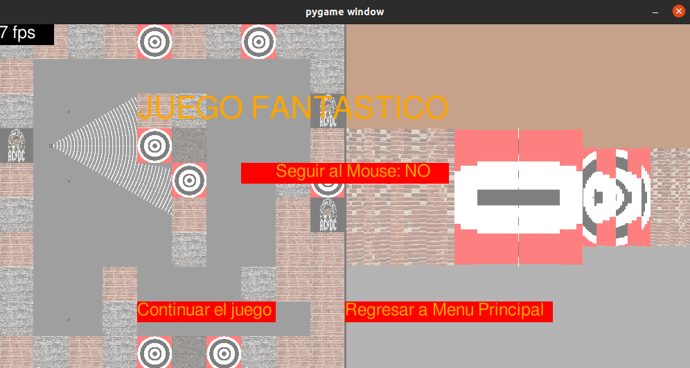

# graficas V2

Repositorio usado para presentar entregas del segundo proyecto para el curso de Gráficas por computadora - UVG 2020

## Proyecto 3 - RC

Esta entrega se basa en los avances del LAB3, agregándole la funcionalidad de sprites, seguir al mouse y un menú de pausa personalizado. Al iniciar el programa se mostrará el menú de inicio, el cual se pueden navegar con el mouse y haciendo clic en los botones. Al iniciar el nivel del juego se renderizará el nivel por defecto usando RC (también se mostrara el minimapa), el cual se puede navegar usando WASD, Q para girar 5 grados a la izquierda, y E para girar a la derecha. Si presiona ESC, se mostrará el menú de pausa, desde el cual se puede reanudar el juego, regresar a la pantalla de inicio, o activar la opción "Seguir al mouse". Ésta última hará que en el minimapa, el jugador siempre apunte a la posición del mouse.

## Ejecución

Para ejecutar la entrega, en la consola es encesario ejecutar 
```
~/ python3 Proyecto.py
```


## Resultados



