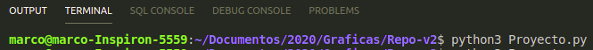
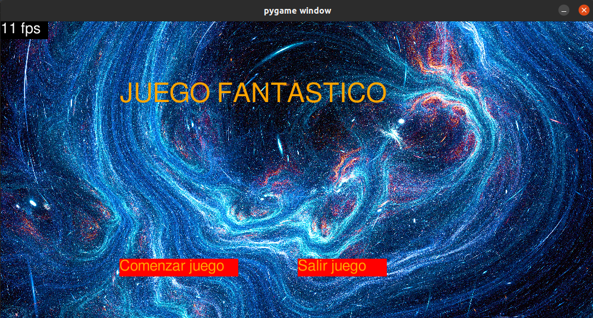
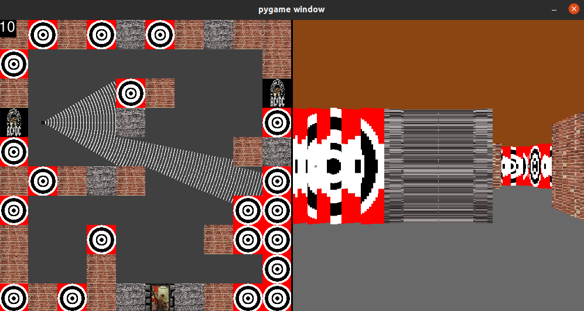

# graficas V2

Repositorio usado para presentar entregas del segundo proyecto para el curso de Gráficas por computadora - UVG 2020

## Lab 3 - UI

Esta entrega amplía la entrega de R2 y le agrega un menu de inicio/pausa. Al iniciar el juego, se muestra al menu de inicio, desde el cual puede comenzar a jugar en el nivel que previamente estaba implementado, o salir.
Dentro del nivel, si se presiona ESC, se habilitará de nuevo la pantalla de inicio/pausa. En esta puede salir del juego, o retomar el nivel desde donde lo dejí.

## Ejecución

Para ejecutar la entrega, en la consola es encesario ejecutar 
```
~/ python3 LAB3.py
```



## Resultados



