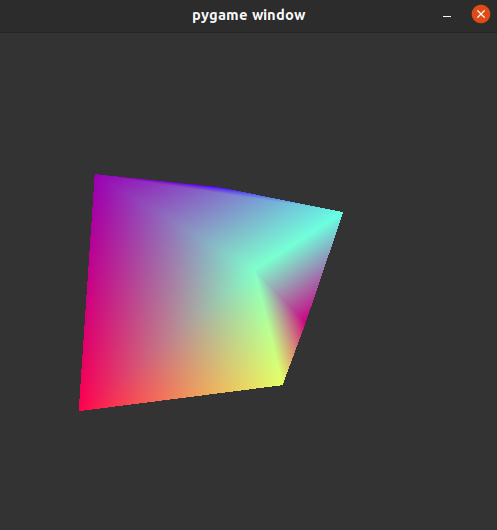

# graficas V2

Repositorio usado para presentar entregas del segundo proyecto para el curso de Gráficas por computadora - UVG 2020

## Ejecución

Para ejecutar la entrega, en la consola es encesario ejecutar 
```
~/ python3 RC1.py
```


## Resultados

